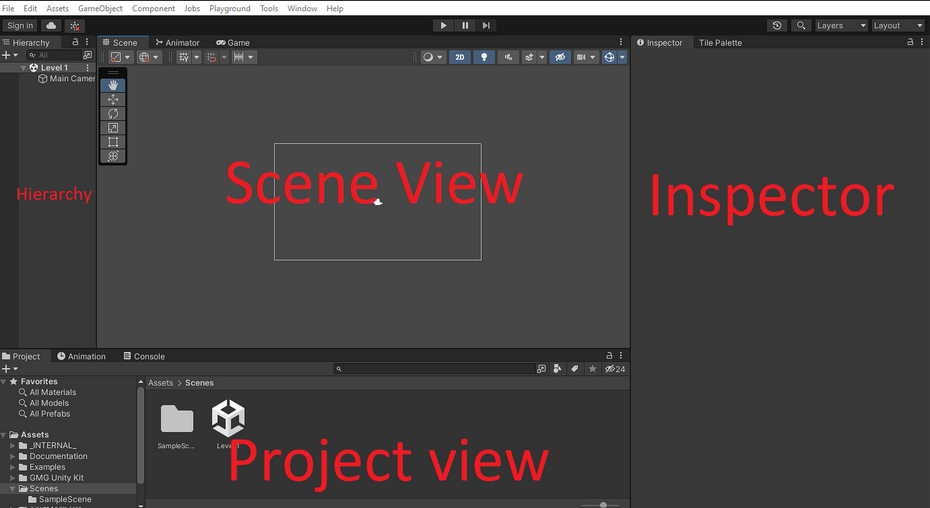

# Unity Setup (VGDA)  
*The following is a sample of my technical writing. The link containing the entire document is down below.*

---

### Unity Interface
Now that Unity is opened up, we can get started on our workshop! Here is a simple breakdown of Unity’s interface so everything isn’t too overwhelming to look at.

When you open up Unity, this is what will be shown. Because these components of the UI can be moved around and even put in separate tabs, it may look a little different, but knowing what these components are is the most important.

**Hierarchy**
This is used to hold everything in our current scene or level. These include cameras, objects, music, and much more! The hierarchy keeps track of all of our objects that we place into our current level or scene.

**Scene View**
This is where you will build your levels, edit/place game objects, and overall how you will visually build your game. We can place players, enemies, and make any changes for your game.

**Inspector**
When you click on a game object, the inspector will show the components of that object. For example, when you click on a player object, more than likely you will find a sprite component that has the art of the player, and a script component that scripts out the movement.

**Project View**
Remember all those folders and files we downloaded earlier? They will all show up down in the project view window. The project view helps us organize and add in the art, code, music, and much more to build your game! In our workshop projects, we already have premade assets ready for you, usually located in the “Assets” folder.

There are many more things in Unity’s UI that you will use later down the line, but these UI components you should learn to know well. These will be the UI components you will be using the most when making a level in a game.

---

### Original Link

Check out the full write-up and documentation [here.](https://docs.google.com/document/d/1sSTR-2QQV7GBPdU0HeGNv0gaIl82rlJ12dFded4hFt8/edit?usp=sharing)