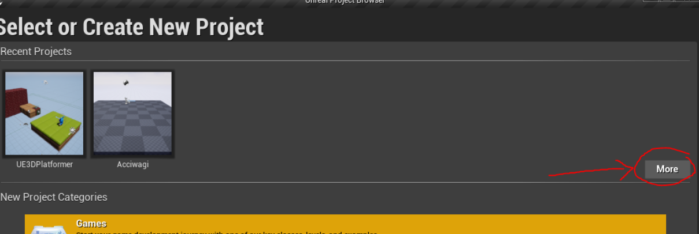
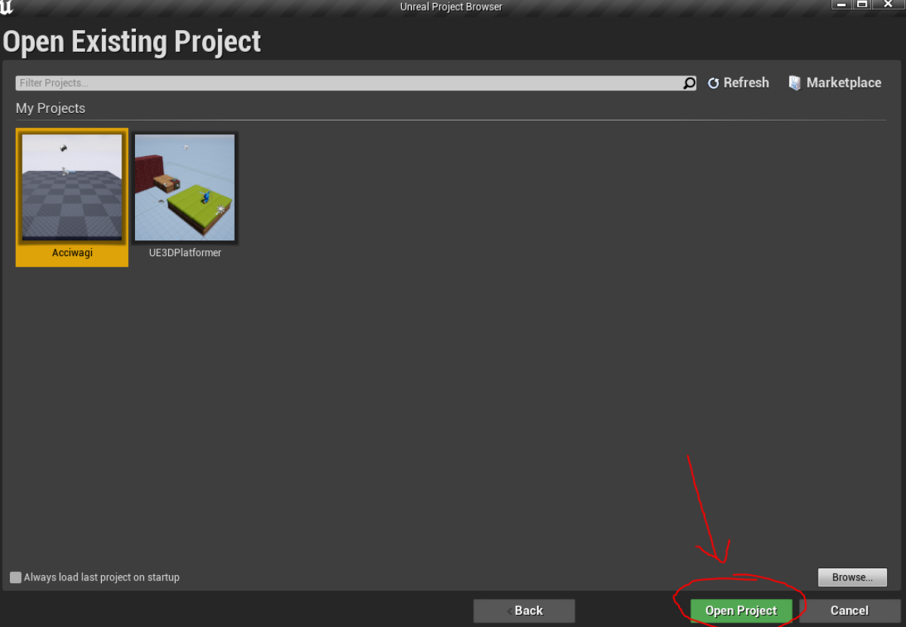
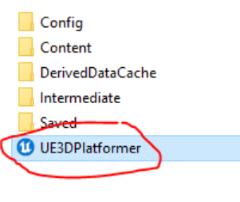

# Unreal Setup (VGDA)
*The following is a sample of my technical writing. The link containing the entire document is down below.*

---
### Opening Unreal Engine

Once you have that downloaded, we can now open Unreal Engine!

When you first open the engine, there will be a list of new options for what kind of project we want to make. Since we are downloading a previously made project, click on “More” under Recent Projects.

Then, click on “Open Project” down below and find the unzipped folder you downloaded earlier.

Every Unreal project will have an Unreal Project (.uproject) file you can use to launch the project onto the engine. Click on this to open up the workshop.

*Once that is done downloading, you’re all set and ready for our Unreal Engine workshop!*

---

### Original Link

Check out the full write-up and documentation [here.](https://docs.google.com/document/d/1UWX4YXmxfMOv0s9M7hMVutqD3_o7T7IcXu-RyGmnbRc/edit?usp=sharing)

